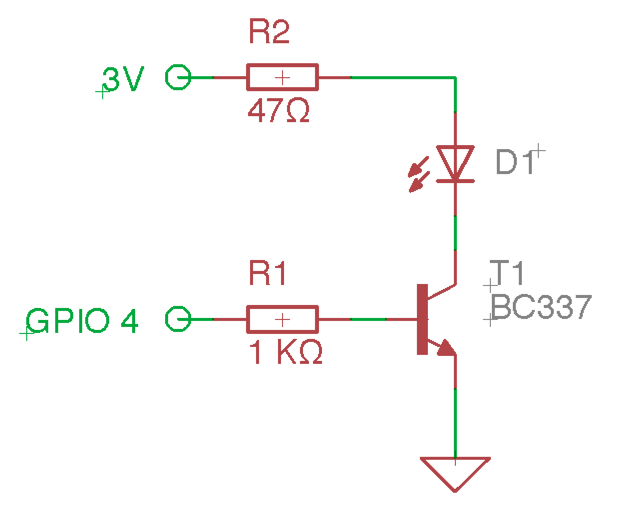
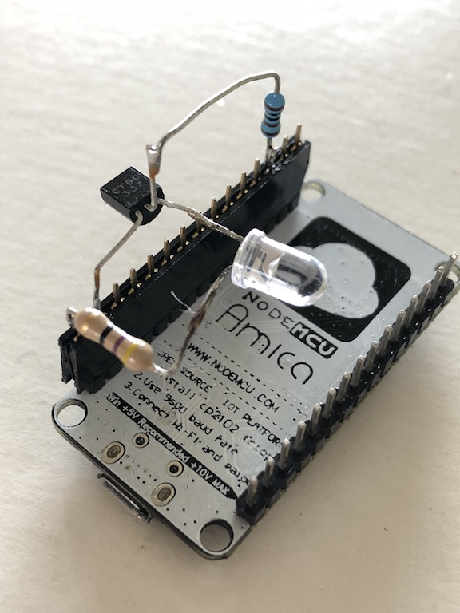

### Helper for teaching universal remotes custom codes.

Normally, a remote controle is used to create a lirc configuratiomn file by using `irrecord`. The project provides the tools for doing the reverse. Create a config file manually, then, teach the codes to a universal remote control. 


### 1. Hardware

- Nodemcu
- BC337 Transistor
- 1KΩ Resistor
- 47Ω Resistor
- IR LED 940nm





### 2. IRremoteESP8266 Installation

1. Click the _"Sketch"_ -> _"Include Library"_ -> _"Manage Libraries..."_ Menu items.
2. Enter `IRremoteESP8266` into the _"Filter your search..."_ top right search box.
3. Click on the IRremoteESP8266 result of the search.
4. Select the version you wish to install and click _"Install"_.

> Update your wifi & password in the `esp8266-ir.ino` source file then compile and upload `esp8266-ir.ino`

### 3. LIRC

Copy `irc.default` as `lirc.conf` and add the customized IR codes, then copy it to the required device

```
sudo systemctl restart lirc
```

### 4. Configure your universal remote control

> update the ESP8266 IP address in the `remote.py` (`server_ip`)

Start the server (`python remote.py`) on your local machine and go to: `http://127.0.0.1:8989/`

The page will show you al list of button name configured in `lirc.conf` and when clicked it would send a request to the NodeMCU which in turn will send the respective IR code. 

Follow the remote control instruction to learn new codes


